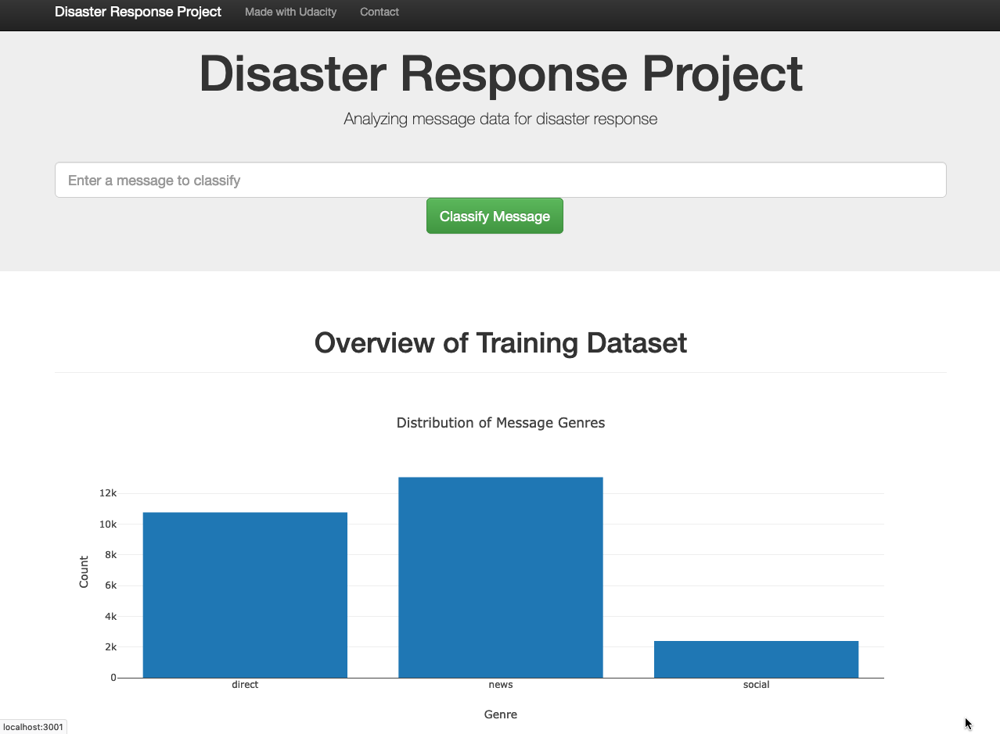
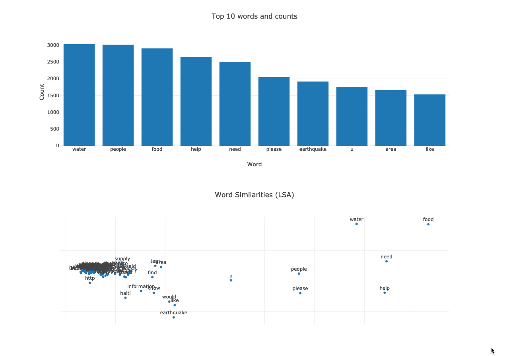

# Disaster Response Pipeline Project

### Purpose
The aim of the project is to build an API that classifies disaster messages.
Using web app emergency worker can input a message and get disaster response in several categories. 
For example "water", "shelter", "food",  are kind of possible categories

This is an overview of the homepage:

### Required Libraries
- Numpy
- Pandas
- Matplotlib
- Json
- Plotly
- Nltk
- Flask
- Sklearn
- Sqlalchemy
- Sys
- Re
- Pickle
### Data engenering and code
- disaster_messages.csv, disaster_categories.csv contain sample messages (real messages that were sent during disaster events) and categories datasets in csv format.
- data/process_data.py: This code extracts data from both CSV files: messages.csv (containing message data) and categories.csv (classes of messages) and creates an SQLite database containing a merged and cleaned version of this data.
- models/train_classifier.py: rain_classifier.py: This code takes the SQLite database produced by process_data.py as an input and uses the data contained within it to train and tune a ML model for categorizing messages. The output is a pickle file containing the fitted model.
Test evaluation metrics are also printed as part of the training proces
- notebooks/ETL_Pipeline_Preparation.ipynb: The code and analysis contained in this Jupyter notebook was used in the development of process_data.py. process_data.py automates this notebook.
- notebooks/ML_Pipeline_Preparation.ipynb: The code and analysis contained in this Jupyter notebook was used in the development of train_classifier.py. In particular, it contains the analysis used to tune the ML model and determine which model to use. train_classifier.py automates the model fitting process contained in this notebook.
### Instructions:
1. Run the following commands in the project's root.
     - I have created a python virtualenv. Activate virtualenv all required packages are already installed.
     Run this command
      `source disasterenv/bin/activate`

    - To run ETL pipeline that cleans data and stores in database
        `python data/process_data.py data/disaster_messages.csv data/disaster_categories.csv data/DisasterResponse.db`
    - To run ML pipeline that trains classifier and saves
        `python models/train_classifier.py data/DisasterResponse.db models/classifier.pkl`

2. Run the following command in the app's directory to run your web app.
    `python run.py`

3. Go to http://0.0.0.0:3001/

### Analysis
We see that data are data are hignly unbalanced which may affect our score.
That's why tunnig the model is very tricky and take much  time for doing an exhaustive search.

It seems adding synthetic data for balanced may give a better score (to do  to optimize the model)
### Acknowledgement
This app was completed as part of the Udacity Data Scientist Nanodegree. Code templates and data were provided by Udacity. The data was originally sourced by Udacity from Figure Eight.
